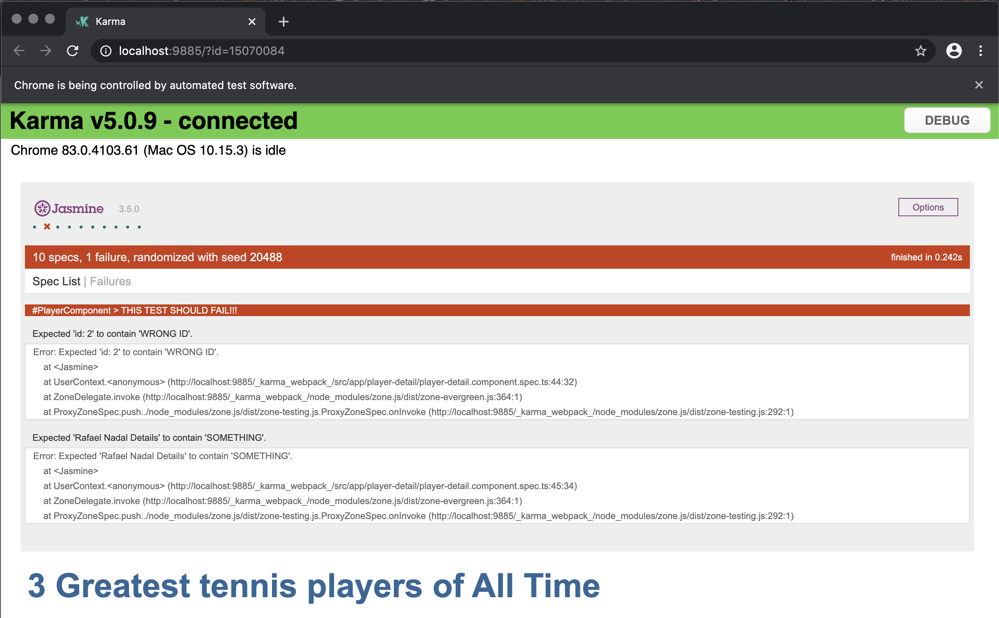
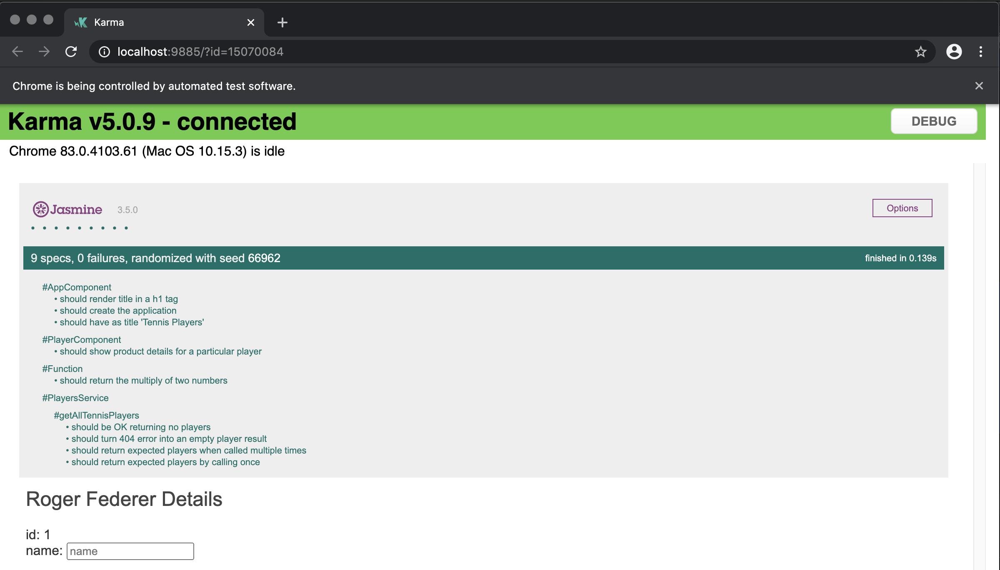

# dmitri-angular-jasmine-karma

## Development server

Run `ng serve` for a dev server. Navigate to `http://localhost:4200/`. The app will automatically reload if you change any of the source files.

## Build

Run `ng build` to build the project. The build artifacts will be stored in the `dist/` directory. Use the `-prod` flag for a production build.

## Running unit tests

Run `ng test` to execute the unit tests via [Karma](https://karma-runner.github.io).

## Tasks and unit tests coverage

1. Set up a Jasmine environment with Karma integration
2. Show a test where an exception occurs at runtime
3. Show a test where a function is tested in an application and show result verification
4. Test a http call in the application. (Verify if there is a http error)
5. Test DOM manipulation (Verify a certain html element exists)

## Application

## Execution with failed test

## Execution with all tests passed

